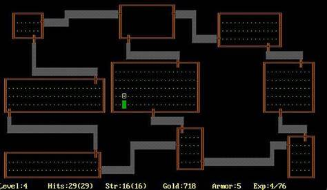
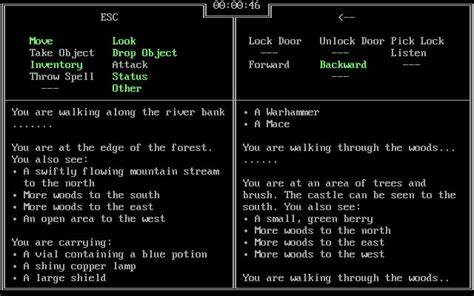
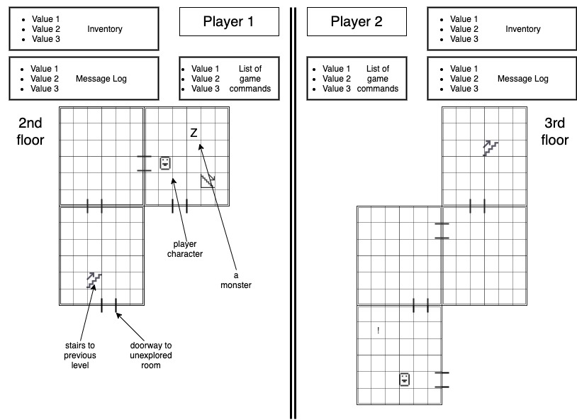

Pondering games that would be simple enough for me to make has gotten me thinking about the DOS-based games I played as a kid in the early 80's.  Two of them, Rogue and Zyll, stand out as games that would be challenging but possible to recreate.  I'd like to create a game that draws inspiration from both of them.
Rogue was an ASCII-based dungeon crawler.  (see screenshot).  Players were represented by a smiley-face extended-ASCII character, and would explore a procedurally generated multi-level dungeon, picking up items and battling monsters (each represented by single letters) as they went.

Zyll was a real-time text-based two-player adventure game.  Each player would use half the keyboard and half the monitor (no peeking allowed!), and would explore the world trying to win before the other player did.

I'd like to create a Rogue-style dungeon crawler, but real-time for two players with a Zyll-style split screen.  Players will start at different points in the dungeon (though for ease of map generation, I'm imagining more a blocky office building that has suffered some sort of calamity).  They'll explore the office building, looking for two keys that unlock the exit.  Both keys are necessary to win.  Along the way, they'll upgrade themselves with items they stumble across (things like flashlights and bike helmets), fight computer opponents, and possibly fight each other.  

For my MVP, I' envisioning:
-a single-level map, consisting of 4-6 rooms made of nested grid elements. The map would be represented on the back end as an undirected graph.  The portion of the map explored by each player is displayed on their side of the screen.
-a few different monsters, and a few different powerups
-s pane for each player listing their game controls
-a pane for each player displaying their inventory and vital stats

extras:
- make map multi-level
- make map randomly generated
- make character classes
- more items and monsters
- more styling
- AI for one of the players?